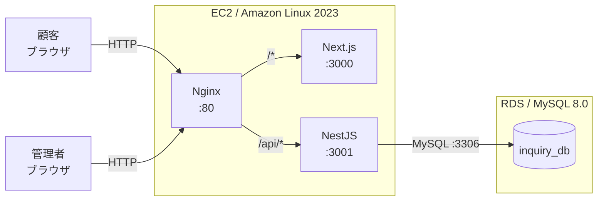
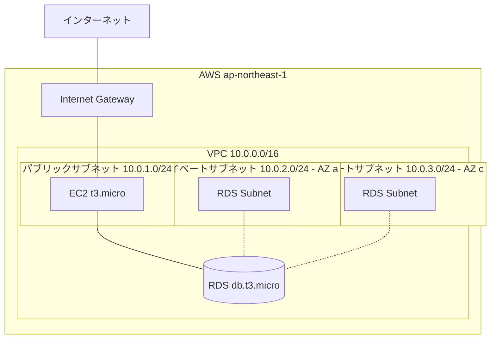

# InquiryManagement — 問い合わせ管理アプリ

問い合わせ受付・対応状況管理を行う Web アプリケーション。

## 課題情報

| 項目 | 内容 |
| --- | --- |
| コース | RaiseTech AI エンジニアコース |
| 課題 | 第3回課題 |
| 方針 | TaskManagement とは異なる技術スタックで構築 |
| MVP 機能 | F-01 〜 F-06（公開フォーム送信・管理者ログイン・問い合わせ管理） |
| スコープ外 | F-07 〜 F-11（メール通知・担当者割当・社内コメント等） |

---

## デモ（画面証跡）

### F-01: 問い合わせ送信フォーム

公開ページから顧客が問い合わせを送信できる機能。バリデーションとスパム対策（IP レートリミット）を実装。

| 内容 | 証跡 |
| --- | --- |
| フォーム初期表示 |  |
| 入力エラー表示 |  |
| 送信 → 完了画面遷移 | [▶ 録画を見る](docs/evidence/03-inquiry-submit.mp4) |
| レートリミット（429） |  |

### F-02: 送信完了画面

送信成功後に受付番号を表示する画面。

| 内容 | 証跡 |
| --- | --- |
| 完了画面 |  |

### F-03: 管理者ログイン / ログアウト

JWT（HttpOnly Cookie）で認証する管理者ログイン。

| 内容 | 証跡 |
| --- | --- |
| ログイン → 一覧遷移 → ログアウト | [▶ 録画を見る](docs/evidence/06-admin-login-logout.mp4) |
| 認証エラー表示 |  |

### F-04: 問い合わせ一覧

受信日時降順で一覧表示。1ページ 20 件のページング。

| 内容 | 証跡 |
| --- | --- |
| 一覧表示 |  |

### F-05: 問い合わせ詳細・ステータス変更

詳細閲覧と「未対応 / 対応中 / 完了」のステータス変更。

| 内容 | 証跡 |
| --- | --- |
| 詳細閲覧 + ステータス変更 | [▶ 録画を見る](docs/evidence/09-admin-detail-status.mp4) |

### F-06: 一覧の絞り込み・ソート

ステータスフィルタ、受信日時ソート、経過日数表示。

| 内容 | 証跡 |
| --- | --- |
| フィルタ・ソート操作 | [▶ 録画を見る](docs/evidence/10-admin-filter-sort.mp4) |
| 経過日数の強調表示 |  |

---

## AWS デプロイ証跡

> Terraform で AWS にインフラを構築し、本番環境で動作することを確認する。

| 内容 | 証跡 |
| --- | --- |
| `terraform apply` 出力 |  |
| AWS コンソール: EC2 インスタンス |  |
| AWS コンソール: RDS |  |
| AWS コンソール: VPC リソースマップ |  |
| 本番 URL でアプリ表示 |  |
| 本番で問い合わせ送信 → DB 保存 | [▶ 録画を見る](docs/evidence/25-prod-end-to-end.mp4) |

**本番アクセス URL**: `http://<EC2 public IP>`（デプロイ後に追記）

---

## アーキテクチャ

### システム構成図



### AWS インフラ構成図



詳細は [docs/infrastructure.md](docs/infrastructure.md) を参照。

---

## 技術スタック

| レイヤー | 技術 | バージョン |
| --- | --- | --- |
| フロントエンド | Next.js + TypeScript + Tailwind CSS | 16.x |
| バックエンド | NestJS + TypeScript + TypeORM | 11.x |
| データベース | MySQL | 8.0 |
| 認証 | JWT（HttpOnly Cookie）/ bcrypt | — |
| スパム対策 | `@nestjs/throttler`（IP レートリミット） | — |
| インフラ | AWS（VPC + EC2 + RDS）+ Terraform | TF 1.5+ |
| プロセス管理 | PM2 | — |
| リバースプロキシ | Nginx | — |

---

## 実装した機能（MVP）

| ID | 機能 | 概要 |
| --- | --- | --- |
| F-01 | 問い合わせ送信フォーム | 公開フォームから問い合わせを送信。バリデーション + IP レートリミット（5回/分） |
| F-02 | 送信完了画面 | 受付番号を表示 |
| F-03 | 管理者ログイン / ログアウト | JWT + HttpOnly Cookie + bcrypt ハッシュ |
| F-04 | 問い合わせ一覧 | 受信日時降順、20件ページング |
| F-05 | 問い合わせ詳細・ステータス変更 | 未対応 / 対応中 / 完了 の遷移 |
| F-06 | 一覧の絞り込み・ソート | ステータスフィルタ、受信日時ソート、経過日数の強調表示 |

### スコープ外（フェーズ2）

F-07 社内コメント / F-08 担当者割当 / F-09 受付完了メール / F-10 ステータス変更通知メール / F-11 管理者ユーザー管理（ロール）

---

## ドキュメント

| ドキュメント | 内容 |
| --- | --- |
| [docs/requirements.md](docs/requirements.md) | 要件定義 |
| [docs/functional-requirements.md](docs/functional-requirements.md) | 機能要件・ユースケース |
| [docs/screen-design.md](docs/screen-design.md) | 画面設計・遷移図 |
| [docs/database-design.md](docs/database-design.md) | DB 設計・ER 図 |
| [docs/tech-stack.md](docs/tech-stack.md) | 技術スタック詳細 |
| [docs/infrastructure.md](docs/infrastructure.md) | インフラ構成・Terraform |

---

## ローカル開発環境のセットアップ

### 前提条件

- Node.js 24.x
- Docker / Docker Compose
- npm

### 手順

```bash
# 1. リポジトリをクローン
git clone <repo-url>
cd InquiryManagement

# 2. 環境変数を設定
cp backend/.env.example backend/.env
cp frontend/.env.example frontend/.env.local

# 3. MySQL を起動
docker compose up -d

# 4. バックエンドを起動（port 3001）
cd backend
npm install
npm run start:dev

# 5. 別ターミナルで管理者ユーザーを作成
cd backend
npm run seed
# → admin@example.com / password123

# 6. フロントエンドを起動（port 3000）
cd ../frontend
npm install
npm run dev
```

### アクセス先

| 画面 | URL |
| --- | --- |
| フロントエンド | <http://localhost:3000> |
| バックエンド API | <http://localhost:3001> |
| MySQL | localhost:3306 |

### 開発ルール

[CLAUDE.md](./CLAUDE.md) の命名規則・GitHub ワークフロー・サーバー起動ルールを参照。

---

## 本番デプロイ手順（AWS）

```bash
# 1. キーペアを AWS に作成（初回のみ）
aws ec2 create-key-pair --region ap-northeast-1 \
  --key-name inquiry-management-key --query 'KeyMaterial' --output text \
  > ~/.ssh/inquiry-management-key.pem
chmod 600 ~/.ssh/inquiry-management-key.pem

# 2. terraform.tfvars を作成
cd terraform
cp terraform.tfvars.example terraform.tfvars
# terraform.tfvars を編集（key_pair_name と db_password を本物に置換）

# 3. インフラを構築
terraform init
terraform plan
terraform apply

# 4. 出力された EC2 public IP に SSH 接続
ssh -i ~/.ssh/inquiry-management-key.pem ec2-user@<EC2_PUBLIC_IP>

# 5. EC2 上でアプリをセットアップ（詳細は docs/infrastructure.md 参照）
git clone <repo-url>
# .env を作成、npm install、build、seed、PM2 で起動
```

学習終了時は `terraform destroy` で全リソースを削除すること。
