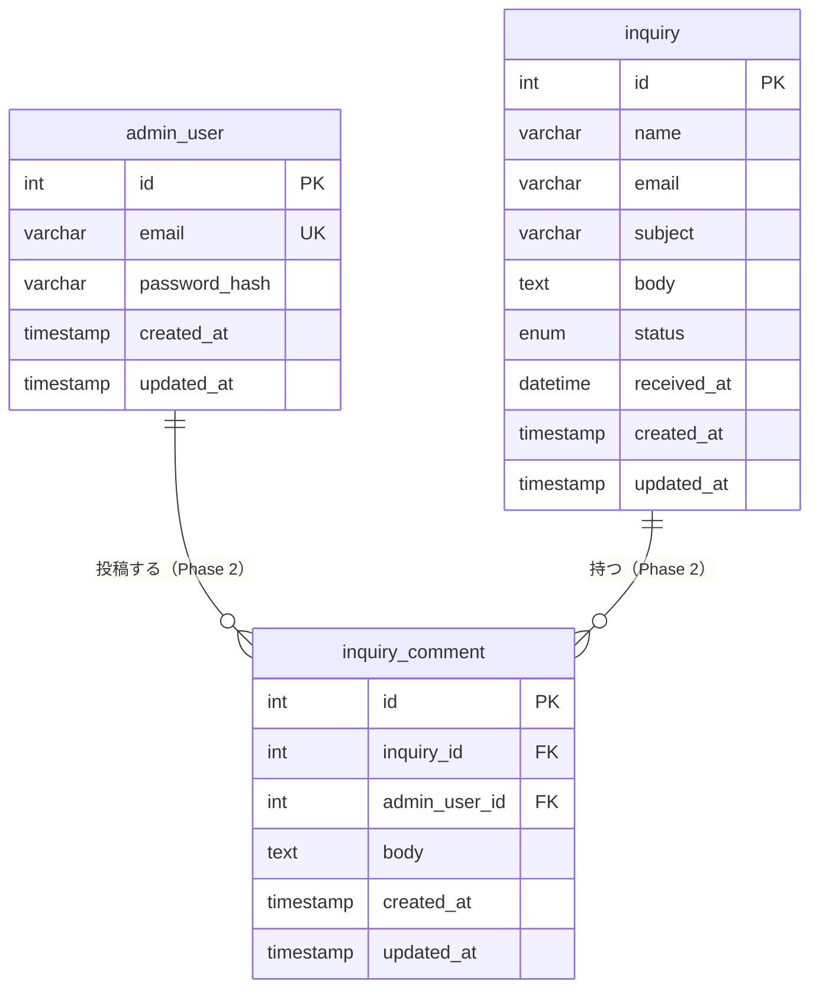

# データベース設計書

## 概要

- **DBMS**: MySQL 8.0
- **文字コード**: `utf8mb4`（絵文字・多言語対応）
- **照合順序**: `utf8mb4_unicode_ci`
- **ストレージエンジン**: InnoDB（外部キー・トランザクション対応）

### フェーズ別テーブル構成

| フェーズ | テーブル |
| --- | --- |
| MVP | `admin_user`, `inquiry` |
| Phase 2 | `inquiry_comment`（新規）、既存テーブルへのカラム追加 |

---

## ER 図



> Phase 2 で追加されるリレーション（担当者割り当て）:
> `admin_user ||--o{ inquiry : "担当する"` （`inquiry.assignee_id` による）

---

## テーブル定義

### admin_user（管理者アカウント）

| カラム名 | 型 | NULL | デフォルト | 説明 |
| --- | --- | --- | --- | --- |
| `id` | INT AUTO_INCREMENT | NO | — | 主キー |
| `email` | VARCHAR(255) | NO | — | ログイン用メールアドレス（一意） |
| `password_hash` | VARCHAR(255) | NO | — | bcrypt ハッシュ（生パスワードは保存しない） |
| `created_at` | TIMESTAMP | NO | CURRENT_TIMESTAMP | レコード作成日時 |
| `updated_at` | TIMESTAMP | NO | CURRENT_TIMESTAMP ON UPDATE | 最終更新日時 |

**Phase 2 追加カラム**

| カラム名 | 型 | NULL | デフォルト | 説明 |
| --- | --- | --- | --- | --- |
| `role` | ENUM('admin','manager') | NO | 'admin' | ロール（MVP では全員 admin） |
| `is_active` | TINYINT(1) | NO | 1 | 有効フラグ（論理削除用） |

**インデックス**

| インデックス名 | カラム | 種別 | 用途 |
| --- | --- | --- | --- |
| PRIMARY | `id` | PRIMARY KEY | — |
| `uq_admin_user_email` | `email` | UNIQUE | ログイン時のメール重複排除 |

---

### inquiry（問い合わせ）

| カラム名 | 型 | NULL | デフォルト | 説明 |
| --- | --- | --- | --- | --- |
| `id` | INT AUTO_INCREMENT | NO | — | 主キー（MVP では受付番号として使用） |
| `name` | VARCHAR(255) | NO | — | 送信者氏名 |
| `email` | VARCHAR(255) | NO | — | 送信者メールアドレス |
| `subject` | VARCHAR(100) | NO | — | 件名（最大 100 文字） |
| `body` | TEXT | NO | — | 問い合わせ本文（最大 2000 文字） |
| `status` | ENUM('open','in_progress','closed') | NO | 'open' | 対応状況 |
| `received_at` | DATETIME | NO | CURRENT_TIMESTAMP | 受信日時（表示・ソートの基準） |
| `created_at` | TIMESTAMP | NO | CURRENT_TIMESTAMP | レコード作成日時 |
| `updated_at` | TIMESTAMP | NO | CURRENT_TIMESTAMP ON UPDATE | 最終更新日時 |

**Phase 2 追加カラム**

| カラム名 | 型 | NULL | デフォルト | 説明 |
| --- | --- | --- | --- | --- |
| `assignee_id` | INT | YES | NULL | 担当管理者 ID（`admin_user.id` への FK） |

**インデックス**

| インデックス名 | カラム | 種別 | 用途 |
| --- | --- | --- | --- |
| PRIMARY | `id` | PRIMARY KEY | — |
| `idx_inquiry_received_at` | `received_at DESC` | INDEX | 受信日時ソート（デフォルト順） |
| `idx_inquiry_status_received_at` | `status`, `received_at DESC` | INDEX | ステータスフィルター＋日時ソートの複合 |

**ステータス値**

| 値 | 表示 | 説明 |
| --- | --- | --- |
| `open` | 未対応 | 初期状態 |
| `in_progress` | 対応中 | 対応着手済み |
| `closed` | 完了 | 対応完了 |

---

### inquiry_comment（内部コメント）— Phase 2

| カラム名 | 型 | NULL | デフォルト | 説明 |
| --- | --- | --- | --- | --- |
| `id` | INT AUTO_INCREMENT | NO | — | 主キー |
| `inquiry_id` | INT | NO | — | 対象問い合わせ（`inquiry.id` への FK） |
| `admin_user_id` | INT | NO | — | 投稿者（`admin_user.id` への FK） |
| `body` | TEXT | NO | — | コメント本文（最大 2000 文字） |
| `created_at` | TIMESTAMP | NO | CURRENT_TIMESTAMP | 投稿日時 |
| `updated_at` | TIMESTAMP | NO | CURRENT_TIMESTAMP ON UPDATE | 最終更新日時 |

**インデックス**

| インデックス名 | カラム | 種別 | 用途 |
| --- | --- | --- | --- |
| PRIMARY | `id` | PRIMARY KEY | — |
| `idx_inquiry_comment_inquiry_id` | `inquiry_id`, `created_at` | INDEX | 問い合わせ別コメント一覧（時系列順） |
| `idx_inquiry_comment_admin_user_id` | `admin_user_id` | INDEX | 投稿者別検索 |

**外部キー制約**

| 制約名 | カラム | 参照先 | ON DELETE |
| --- | --- | --- | --- |
| `fk_inquiry_comment_inquiry_id` | `inquiry_id` | `inquiry(id)` | CASCADE（問い合わせ削除時にコメントも削除） |
| `fk_inquiry_comment_admin_user_id` | `admin_user_id` | `admin_user(id)` | RESTRICT（投稿者のアカウントは削除不可） |

---

## DDL

### MVP

```sql
CREATE TABLE admin_user (
  id           INT          NOT NULL AUTO_INCREMENT,
  email        VARCHAR(255) NOT NULL,
  password_hash VARCHAR(255) NOT NULL,
  created_at   TIMESTAMP    NOT NULL DEFAULT CURRENT_TIMESTAMP,
  updated_at   TIMESTAMP    NOT NULL DEFAULT CURRENT_TIMESTAMP
                                     ON UPDATE CURRENT_TIMESTAMP,
  PRIMARY KEY (id),
  UNIQUE KEY uq_admin_user_email (email)
) ENGINE=InnoDB DEFAULT CHARSET=utf8mb4 COLLATE=utf8mb4_unicode_ci;

CREATE TABLE inquiry (
  id          INT          NOT NULL AUTO_INCREMENT,
  name        VARCHAR(255) NOT NULL,
  email       VARCHAR(255) NOT NULL,
  subject     VARCHAR(100) NOT NULL,
  body        TEXT         NOT NULL,
  status      ENUM('open','in_progress','closed') NOT NULL DEFAULT 'open',
  received_at DATETIME     NOT NULL DEFAULT CURRENT_TIMESTAMP,
  created_at  TIMESTAMP    NOT NULL DEFAULT CURRENT_TIMESTAMP,
  updated_at  TIMESTAMP    NOT NULL DEFAULT CURRENT_TIMESTAMP
                                    ON UPDATE CURRENT_TIMESTAMP,
  PRIMARY KEY (id),
  KEY idx_inquiry_received_at (received_at DESC),
  KEY idx_inquiry_status_received_at (status, received_at DESC)
) ENGINE=InnoDB DEFAULT CHARSET=utf8mb4 COLLATE=utf8mb4_unicode_ci;
```

### Phase 2

```sql
-- inquiry テーブルへの追加
ALTER TABLE inquiry
  ADD COLUMN assignee_id INT NULL AFTER status,
  ADD CONSTRAINT fk_inquiry_assignee_id
    FOREIGN KEY (assignee_id) REFERENCES admin_user (id)
    ON DELETE SET NULL;

-- admin_user テーブルへの追加
ALTER TABLE admin_user
  ADD COLUMN role      ENUM('admin','manager') NOT NULL DEFAULT 'admin' AFTER password_hash,
  ADD COLUMN is_active TINYINT(1)              NOT NULL DEFAULT 1       AFTER role;

-- inquiry_comment テーブルの新規作成
CREATE TABLE inquiry_comment (
  id            INT       NOT NULL AUTO_INCREMENT,
  inquiry_id    INT       NOT NULL,
  admin_user_id INT       NOT NULL,
  body          TEXT      NOT NULL,
  created_at    TIMESTAMP NOT NULL DEFAULT CURRENT_TIMESTAMP,
  updated_at    TIMESTAMP NOT NULL DEFAULT CURRENT_TIMESTAMP
                                   ON UPDATE CURRENT_TIMESTAMP,
  PRIMARY KEY (id),
  KEY idx_inquiry_comment_inquiry_id    (inquiry_id, created_at),
  KEY idx_inquiry_comment_admin_user_id (admin_user_id),
  CONSTRAINT fk_inquiry_comment_inquiry_id
    FOREIGN KEY (inquiry_id)    REFERENCES inquiry    (id) ON DELETE CASCADE,
  CONSTRAINT fk_inquiry_comment_admin_user_id
    FOREIGN KEY (admin_user_id) REFERENCES admin_user (id) ON DELETE RESTRICT
) ENGINE=InnoDB DEFAULT CHARSET=utf8mb4 COLLATE=utf8mb4_unicode_ci;
```

---

## 設計メモ

| ID | 項目 | MVP の扱い | Phase 2 の判断ポイント |
| --- | --- | --- | --- |
| D-01 | 受付番号フォーマット | `inquiry.id` をそのまま使用 | `INQ-YYYY-NNNNN` 形式が必要になった時点でアプリ層でフォーマット |
| D-02 | 担当者割り当て | 未使用（`assignee_id` は NULL） | 1 対 1 で足りるか確認してから `assignee_id` を有効化 |
| D-03 | ステータス変更履歴 | 記録しない | 監査要件が出た場合に `inquiry_status_history` テーブルを追加 |
| D-04 | 管理者の論理削除 | 物理削除 | `is_active = 0` で論理削除に切り替え（コメントの投稿者保持のため） |
| D-05 | メール送信キュー | 同期処理 | 非同期が必要になった場合に専用キューテーブルまたは SQS を検討 |
