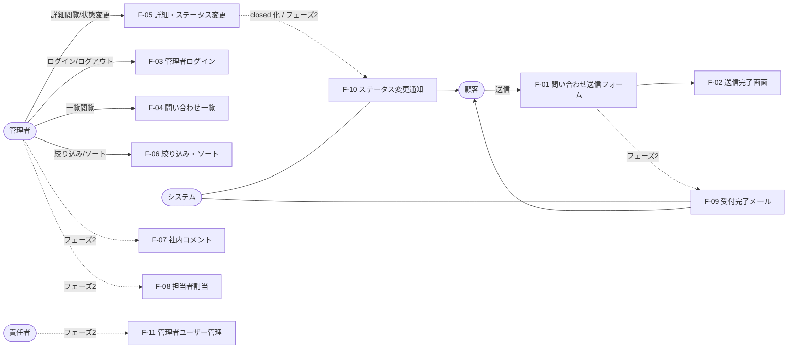

# 機能要件書 — 問い合わせ管理アプリ（InquiryManagement）

## 1. 本書の位置づけ

本書は [要件定義書（requirements.md）](requirements.md) の 5章「機能要件（概要）」を受けて、各機能をユースケース形式で詳細化するドキュメントである。

- 対象範囲: MVP（フェーズ1, F-01〜F-06）と フェーズ2（F-07〜F-11）の **全11機能**。`requirements.md` 1.3 の方針「機能要件・画面設計・DB 設計はフェーズ2 まで描き切る／実装着手は MVP に限定する」に従い、フェーズ2 機能も本書で仕様を確定させる
- 記述粒度: 各機能ごとに「概要 / アクター / 事前条件 / 入力 / 主シナリオ / 代替・例外シナリオ / 事後条件 / 補足」を記載するユースケース形式
- API エンドポイント仕様（HTTP メソッド・パス・リクエスト／レスポンス JSON）は **本書では扱わない**。後続の `api-design.md` で別途定義する
- 画面の遷移・配置・ワイヤーフレームは [画面設計書（screen-design.md）](screen-design.md)、データモデルは [データベース設計書（database-design.md）](database-design.md) で定義する

---

## 2. 機能一覧

`requirements.md` 5章と完全に一致する。詳細は本書 4章を参照。

| 区分 | ID | 機能名 | 概要 | アクター | フェーズ |
| --- | --- | --- | --- | --- | --- |
| 公開 | F-01 | 問い合わせ送信フォーム | 氏名・メール・件名・本文を入力して送信 | 顧客 | MVP |
| 公開 | F-02 | 送信完了画面 | 受付番号と案内文を表示 | 顧客 | MVP |
| 認証 | F-03 | 管理者ログイン／ログアウト | メール+パスワードで JWT を発行／破棄 | 管理者 | MVP |
| 管理 | F-04 | 問い合わせ一覧 | 全問い合わせをページング表示 | 管理者 | MVP |
| 管理 | F-05 | 問い合わせ詳細・ステータス変更 | 詳細閲覧と「未対応／対応中／完了」の切替 | 管理者 | MVP |
| 管理 | F-06 | 一覧の絞り込み・ソート | ステータス別フィルタ、受信日時ソート、経過日数表示 | 管理者 | MVP |
| 管理 | F-07 | 対応履歴（社内コメント） | 内部メモ投稿、時系列表示 | 管理者 | フェーズ2 |
| 管理 | F-08 | 担当者割当 | 問い合わせに担当管理者をアサイン | 管理者 | フェーズ2 |
| 通知 | F-09 | 受付完了メール（顧客向け） | 送信時に顧客へ自動メール送信 | 顧客 | フェーズ2 |
| 通知 | F-10 | ステータス変更通知 | 完了時に顧客へ自動メール送信 | 顧客 | フェーズ2 |
| 認証 | F-11 | 管理者ユーザー管理（role） | 管理者の追加・削除・役割付与 | 責任者 | フェーズ2 |

---

## 3. 共通仕様

### 3.1 アクター定義

| アクター | 認証 | 権限スコープ |
| --- | --- | --- |
| 顧客（一般顧客） | 不要（未ログイン） | 公開フォーム送信、送信完了画面の閲覧のみ |
| 管理者 | 必要（JWT） | 管理画面の全機能。MVP では一次対応担当・責任者を区別せずフラットな1ロール |
| 責任者（フェーズ2） | 必要（JWT, role=`manager`） | 管理者機能 + 管理者ユーザー管理（F-11） |

> MVP では管理者ロールは1種類（`admin` 相当）。`manager` ロールはフェーズ2 で導入する。

### 3.2 認証方式

- 管理者は **メール+パスワード** で `F-03` ログインを行い、JWT を取得する
- JWT は **HttpOnly Cookie** で配布する（`requirements.md` 8章セキュリティ要件）
- 有効期限切れ・未認証で管理 API へアクセスした場合は HTTP 401 相当のエラーを返す（API 仕様詳細は `api-design.md` 参照）
- ログアウトは Cookie を破棄する

### 3.3 ステータス値

問い合わせは以下3状態のいずれかを持つ。MVP・フェーズ2 共通。

| 値 | 表示名 | 意味 |
| --- | --- | --- |
| `open` | 未対応 | 受信したまま、まだ誰も着手していない初期値 |
| `in_progress` | 対応中 | 管理者が対応に着手した状態 |
| `closed` | 完了 | 対応が完了した状態 |

- 状態遷移は **任意の組み合わせを許容**（`open ↔ in_progress ↔ closed` いずれも可）
- MVP では遷移ログは保持しない（誰がいつ何に変更したかの履歴は持たない）。フェーズ2 で履歴対応を検討（[7章](#7-未確定事項フェーズ2-検討事項) 参照）

### 3.4 共通バリデーション方針

- 必須項目が未入力の場合、フィールド単位でエラーメッセージを返す（画面に1件ずつ表示できるよう、フィールド名キーで返す）
- 文字列の長さ制限は **コードポイント数** で判定（絵文字や合字を1文字としてカウント）
- メールアドレスは RFC 5322 を満たすこと、255 文字以内
- 入力値は **前後の空白を trim** したうえで保存・判定する
- バリデーションエラー時は HTTP 400 系で応答し、画面は入力内容を保持する

### 3.5 共通エラー方針

| 種別 | 想定挙動 |
| --- | --- |
| 入力検証エラー | フィールド単位のメッセージを画面表示。送信内容は失わない |
| 認証エラー（管理画面） | ログイン画面へリダイレクト。元の遷移先 URL を保持しログイン後に復帰 |
| 認可エラー（フェーズ2 ロール不足） | 403 相当のエラー画面を表示（管理画面内のため） |
| 該当データなし | 404 相当の画面表示 |
| サーバ内部エラー | 汎用エラー画面 + 「時間をおいて再度お試しください」案内 |

### 3.6 ページング方針

- 一覧系（F-04, F-06）は **ページング前提**。1ページあたり既定 20 件を想定
- ページ番号は1始まり、URL クエリパラメータで保持してリロードに耐えること
- ページサイズは MVP では固定（20）。フェーズ2 で可変化を検討

---

## 4. 機能詳細（ユースケース）

### F-01: 問い合わせ送信フォーム [MVP]

- **概要**: 顧客が公開フォームから問い合わせを送信する。
- **アクター**: 顧客
- **事前条件**: なし（未認証）
- **入力項目**:

  | 項目 | 必須 | 型 | 制約 |
  | --- | --- | --- | --- |
  | 氏名 | ○ | 文字列 | 1〜255 文字 |
  | メールアドレス | ○ | 文字列 | RFC 5322 準拠、255 文字以内 |
  | 件名 | ○ | 文字列 | 1〜100 文字 |
  | 本文 | ○ | 文字列 | 1〜2000 文字、改行を含む |
  | スパム対策トークン | ○ | 文字列 | reCAPTCHA / honeypot / IP レートリミット いずれかを必ず実装 |

- **主シナリオ**:
  1. 顧客が公開フォーム画面を開く
  2. 氏名・メール・件名・本文を入力する
  3. 「送信」ボタンを押下する
  4. クライアント側でバリデーションを行い、問題なければサーバへ送信する
  5. サーバはバリデーション・スパム判定を行い、`inquiry` レコードを `status=open` で作成する
  6. システムが受付番号（MVP では `inquiry.id` を流用）を発行する
  7. F-02「送信完了画面」へ遷移する
- **代替・例外シナリオ**:
  - 入力検証エラー: 該当フィールドにエラーメッセージを表示。送信せず入力値を保持
  - スパム判定でブロックされた場合: 「送信できませんでした。お時間をおいて再度お試しください」を表示し、レコードは作成しない
  - サーバ障害: 汎用エラー画面を表示し、ユーザに再試行を促す。レコードは作成しない
- **事後条件**:
  - `inquiry` レコードが1件作成されている（`status=open`, `received_at=現在時刻`）
  - 受付番号が顧客に提示できる状態になっている
- **補足**:
  - フェーズ2 では F-09「受付完了メール」と連携し、本機能の処理完了直後に自動送信する
  - 個人情報を扱うため HTTPS 必須（`requirements.md` 8章）

### F-02: 送信完了画面 [MVP]

- **概要**: 問い合わせ送信が完了したことを顧客に明示し、受付番号を表示する。
- **アクター**: 顧客
- **事前条件**: F-01 で問い合わせ送信が成功している
- **入力項目**: なし（直前の送信結果を引き継ぐ）
- **主シナリオ**:
  1. F-01 の主シナリオ7から遷移してくる
  2. 受付番号と案内文（「お問い合わせを受け付けました。担当者よりご連絡いたします。」相当）を表示する
  3. トップページ（または公開サイト）へのリンクを表示する
- **代替・例外シナリオ**:
  - 直接 URL で本画面に到達した場合（受付番号情報なし）: 公開フォームへリダイレクトする
- **事後条件**:
  - 顧客に受付番号が伝わっている
- **補足**:
  - 受付番号体系: MVP では `inquiry.id`（数値）をそのまま提示する。フェーズ2 で `INQ-2026-00042` 等の体系を検討（`requirements.md` 7章注記と整合）
  - フェーズ2 では F-09 の受付完了メールにも同じ受付番号を含める

### F-03: 管理者ログイン／ログアウト [MVP]

- **概要**: 管理者がメール+パスワードでログインし、JWT を取得する。ログアウト時は破棄する。
- **アクター**: 管理者
- **事前条件**:
  - ログイン: `admin_user` レコードが事前に登録されていること（MVP では手動シード）
  - ログアウト: ログイン済みであること
- **入力項目（ログイン）**:

  | 項目 | 必須 | 型 | 制約 |
  | --- | --- | --- | --- |
  | メールアドレス | ○ | 文字列 | RFC 5322 準拠 |
  | パスワード | ○ | 文字列 | 8 文字以上 |

- **主シナリオ（ログイン）**:
  1. 管理者がログイン画面を開く
  2. メール・パスワードを入力し「ログイン」を押下
  3. サーバは `admin_user.email` で照会し、保存されたハッシュ（bcrypt 等）と入力値を照合
  4. 照合成功時、JWT を発行し HttpOnly Cookie に保存
  5. 管理画面トップ（問い合わせ一覧 = F-04）へリダイレクト
- **主シナリオ（ログアウト）**:
  1. 管理者が「ログアウト」を押下
  2. サーバは Cookie を破棄しレスポンスする
  3. ログイン画面へリダイレクト
- **代替・例外シナリオ**:
  - 認証情報不一致: 「メールアドレスまたはパスワードが正しくありません」を表示。ユーザ存在の有無は明示しない（列挙攻撃対策）
  - 入力検証エラー: フィールド単位でエラー表示
  - ロックアウト方針: MVP では未実装。フェーズ2 で連続失敗時の一時ロックを検討
- **事後条件**:
  - ログイン: JWT を保持した認証済み状態になっている
  - ログアウト: 認証情報が破棄され未認証状態になっている
- **補足**:
  - パスワードは bcrypt 等で **必ずハッシュ化して保存**（`requirements.md` 8章）
  - JWT のクレームには `admin_user.id` と発行時刻を含める。ロール情報はフェーズ2 で追加

### F-04: 問い合わせ一覧 [MVP]

- **概要**: 管理者が全問い合わせをページング表示で確認する。
- **アクター**: 管理者
- **事前条件**: ログイン済み
- **入力項目**:

  | 項目 | 必須 | 型 | 制約 |
  | --- | --- | --- | --- |
  | ページ番号 | × | 整数 | 1 以上、未指定時は 1 |

- **主シナリオ**:
  1. 管理者が管理画面トップ（一覧画面）を開く
  2. システムは `received_at` 降順で問い合わせを 20 件取得する
  3. 各行に「受付番号 / 受信日時 / 氏名 / 件名（先頭抜粋）/ ステータス / 経過日数」を表示する
  4. ページネーションコントロール（前へ／次へ／総件数）を表示する
  5. 行クリックで F-05「問い合わせ詳細」へ遷移する
- **代替・例外シナリオ**:
  - 0 件の場合: 「問い合わせはまだありません」を表示
  - 不正なページ番号（範囲外、0 や負数）: 1 ページ目にフォールバック
  - 未認証: ログイン画面へリダイレクト（共通仕様 3.5）
- **事後条件**:
  - 表示中ページのデータが画面に反映されている
- **補足**:
  - フィルタ・ソートの絞り込み UI は F-06 で詳述
  - フェーズ2 で F-08 担当者割当を有効化した際は「担当者」列を追加する

### F-05: 問い合わせ詳細・ステータス変更 [MVP]

- **概要**: 管理者が個別の問い合わせを閲覧し、ステータスを変更する。
- **アクター**: 管理者
- **事前条件**: ログイン済み、対象の `inquiry` が存在する
- **入力項目（ステータス変更）**:

  | 項目 | 必須 | 型 | 制約 |
  | --- | --- | --- | --- |
  | 新ステータス | ○ | 列挙 | `open` / `in_progress` / `closed` のいずれか |

- **主シナリオ（閲覧）**:
  1. 管理者が一覧（F-04 / F-06）から問い合わせを選択
  2. 詳細画面に「受付番号 / 受信日時 / 氏名 / メール / 件名 / 本文（全文）/ 現在のステータス」を表示
- **主シナリオ（ステータス変更）**:
  1. 詳細画面のステータス操作 UI（プルダウンまたはボタン）で新ステータスを選択
  2. 「変更を保存」を押下
  3. サーバは `inquiry.status` を更新する
  4. 画面に「変更しました」のフィードバックを表示し、最新値を反映
- **代替・例外シナリオ**:
  - 該当 ID なし: 404 画面を表示し一覧へ戻る導線を提示
  - 同時編集（楽観ロック相当）: MVP では考慮しない（後勝ち）。フェーズ2 で必要なら検討
  - 未認証: ログイン画面へリダイレクト
- **事後条件**:
  - 指定問い合わせのステータスが新値に更新されている
- **補足**:
  - 状態遷移は任意の組み合わせを許容（共通仕様 3.3）
  - フェーズ2 で F-07 コメント、F-08 担当者割当、F-10 完了通知メール（`closed` 化時）と連携する

### F-06: 一覧の絞り込み・ソート [MVP]

- **概要**: 一覧をステータスや受信日時で絞り込み・ソートできるようにする。
- **アクター**: 管理者
- **事前条件**: ログイン済み（F-04 と同じ画面で動作）
- **入力項目**:

  | 項目 | 必須 | 型 | 制約 |
  | --- | --- | --- | --- |
  | ステータスフィルタ | × | 列挙（複数可） | `open` / `in_progress` / `closed`、未指定時は全件 |
  | ソートキー | × | 列挙 | `received_at` のみ（MVP）。既定値 `received_at` |
  | ソート順 | × | 列挙 | `desc` / `asc`、既定値 `desc` |

- **主シナリオ**:
  1. 管理者が一覧画面でフィルタ条件・ソートを変更する
  2. URL クエリに条件が反映され、システムは条件に合致するレコードを再取得する
  3. 各行に **経過日数**（現在時刻 − `received_at` の整数日）を表示
  4. 経過日数が一定閾値（例: 3 日）を超えた `open` 行は **視覚的に強調**（背景色や警告アイコン）する
- **代替・例外シナリオ**:
  - 0 件: 「条件に一致する問い合わせはありません」を表示。フィルタ解除導線を出す
  - 不正な値（クエリ手書きで未定義の値）: 既定値（全件・降順）にフォールバック
- **事後条件**:
  - フィルタ・ソート条件と表示結果が URL に保存されている（リロード・共有で再現可能）
- **補足**:
  - 強調表示の閾値（3 日）は MVP では定数。フェーズ2 でユーザ設定可能化を検討
  - 件数集計（未対応/対応中/完了の件数表示）はフェーズ2 で検討

### F-07: 対応履歴（社内コメント） [フェーズ2]

- **概要**: 管理者が問い合わせに対して内部メモを残し、時系列で確認できる。
- **アクター**: 管理者
- **事前条件**: ログイン済み、対象の `inquiry` が存在する
- **入力項目（投稿）**:

  | 項目 | 必須 | 型 | 制約 |
  | --- | --- | --- | --- |
  | コメント本文 | ○ | 文字列 | 1〜2000 文字 |

- **主シナリオ**:
  1. 管理者が問い合わせ詳細画面（F-05）の「社内コメント」セクションを開く
  2. コメント本文を入力し「投稿」を押下
  3. システムは `inquiry_comment` レコードを作成（投稿者 = 自分の `admin_user.id`、投稿時刻 = 現在）
  4. コメント一覧を時系列（投稿日時昇順）で再描画する
- **代替・例外シナリオ**:
  - 入力検証エラー: フィールド単位でエラー表示、入力値は保持
  - 該当 `inquiry` なし: 404 表示
- **事後条件**:
  - `inquiry_comment` レコードが1件追加されている
- **補足**:
  - **顧客には公開しない内部メモ**である旨を画面で明示する
  - MVP では未実装。フェーズ2 で導入
  - 編集・削除のスコープ: **MVP 観点では未提供。フェーズ2 では「投稿者本人のみ削除可能」「編集は不可（履歴汚染防止）」を初期方針とし、実装着手時に最終確定する**

### F-08: 担当者割当 [フェーズ2]

- **概要**: 問い合わせに対して担当管理者を1名アサインし、二重対応を防ぐ。
- **アクター**: 管理者
- **事前条件**: ログイン済み、対象の `inquiry` が存在する
- **入力項目**:

  | 項目 | 必須 | 型 | 制約 |
  | --- | --- | --- | --- |
  | 担当管理者 | × | `admin_user.id` 参照 | 解除時は `null` |

- **主シナリオ**:
  1. 管理者が問い合わせ詳細画面で担当者プルダウンから自分または別管理者を選択
  2. 「保存」を押下
  3. システムは `inquiry.assignee_id` を更新する
  4. 一覧画面の「担当者」列にも反映される
- **代替・例外シナリオ**:
  - 担当者を空（`null`）に戻す操作も許容（割当解除）
  - 存在しない `admin_user.id` を指定された場合: バリデーションエラー
- **事後条件**:
  - 指定問い合わせの担当者が更新されている
- **補足**:
  - **1問い合わせ : 1管理者** の関係を初期方針とする。複数人アサインは導入時の検討事項として残す（[7章](#7-未確定事項フェーズ2-検討事項)）
  - F-04 / F-06 の一覧表示に「担当者」列・フィルタを追加する

### F-09: 受付完了メール（顧客向け） [フェーズ2]

- **概要**: F-01 で問い合わせ送信が成功した直後、顧客のメールアドレス宛に受付完了メールを自動送信する。
- **アクター**: 顧客（受信者）/ システム（送信主体）
- **事前条件**: F-01 の主シナリオが成功し、`inquiry` レコードが作成済み
- **入力項目**: なし（システム自動）
- **主シナリオ**:
  1. F-01 の事後処理（同期 or 非同期）として、受信した `inquiry` を入力にメール送信ジョブを起動
  2. 件名 = 「【受付完了】お問い合わせを受け付けました（受付番号: XXX）」相当
  3. 本文 = 受付番号、受付日時、入力された件名、問い合わせ内容のサマリ、案内文を含む
  4. 顧客の `inquiry.email` 宛に送信
- **代替・例外シナリオ**:
  - 送信失敗（SMTP エラー等）: 一定回数まで再送（指数バックオフ）。最終的に失敗した場合は管理側に通知（運用ログ）
  - メールアドレスが無効: 送信は試みず、運用ログに記録
- **事後条件**:
  - 顧客に受付完了メールが届いている
- **補足**:
  - メールフォーマット（HTML / Plain）方針は **未確定**（[7章](#7-未確定事項フェーズ2-検討事項)）
  - 個人情報保護のため、本文中に問い合わせ全文を含めるかは別途検討
  - 顧客のマイページや返信機能は提供しない（`requirements.md` 10章スコープ外）

### F-10: ステータス変更通知（顧客向け） [フェーズ2]

- **概要**: F-05 で問い合わせのステータスが「完了（`closed`）」に変更されたとき、顧客のメールアドレス宛に自動でメール送信する。
- **アクター**: 顧客（受信者）/ システム（送信主体）
- **事前条件**:
  - 対象 `inquiry` が存在し、ステータスが `closed` 以外から `closed` に変更された
- **入力項目**: なし（システム自動）
- **主シナリオ**:
  1. F-05 のステータス変更処理で **完了化**（`closed`）が確定したタイミングで、メール送信ジョブを起動
  2. 件名 = 「【対応完了】お問い合わせへの対応が完了しました（受付番号: XXX）」相当
  3. 本文 = 受付番号、対応完了日時、案内文を含む
  4. `inquiry.email` 宛に送信
- **代替・例外シナリオ**:
  - `closed` 以外への遷移（`open`, `in_progress`）では送信しない（要件と整合: `requirements.md` 5章「完了時に顧客へ自動メール送信」）
  - `closed` から `closed` への再変更（既に完了済み）では再送しない
  - 送信失敗時の挙動は F-09 と同様
- **事後条件**:
  - 顧客に完了通知メールが届いている
- **補足**:
  - 完了化以外の遷移時に通知が必要となった場合は、要件改訂（フェーズ2 内の追加検討事項）

### F-11: 管理者ユーザー管理（role） [フェーズ2]

- **概要**: 責任者ロールが管理者を追加・削除し、ロールを付与する。
- **アクター**: 責任者（`role=manager`）
- **事前条件**: 責任者ロールでログイン済み
- **入力項目（追加・編集）**:

  | 項目 | 必須 | 型 | 制約 |
  | --- | --- | --- | --- |
  | メールアドレス | ○ | 文字列 | RFC 5322 準拠、255 文字以内、システム内一意 |
  | 初期パスワード | ○（追加時） | 文字列 | 8 文字以上 |
  | ロール | ○ | 列挙 | `admin` / `manager` |

- **主シナリオ（追加）**:
  1. 責任者が「管理者ユーザー管理」画面を開く
  2. 「追加」ボタンから新規入力フォームを開く
  3. メール・初期パスワード・ロールを入力し保存
  4. システムはパスワードをハッシュ化のうえ `admin_user` レコードを作成
- **主シナリオ（削除）**:
  1. 一覧から対象管理者の「削除」を押下
  2. 確認ダイアログで承諾
  3. 該当レコードを削除（または `is_active=false` 化、最終方針は実装着手時）
- **主シナリオ（ロール変更）**:
  1. 一覧から対象管理者を選択しロール変更
  2. 保存で反映
- **代替・例外シナリオ**:
  - 一般 `admin` がアクセスした場合: 認可エラー（403 相当）画面を表示
  - メール重複: バリデーションエラー
  - 自分自身を削除しようとした場合: ブロックする
  - 最後の `manager` を削除／降格しようとした場合: ブロックする（責任者不在の防止）
- **事後条件**:
  - `admin_user` テーブルが期待通り更新されている
- **補足**:
  - ロール構成は `admin` / `manager` の **2種** を初期方針とする。3 段階以上の権限分離は将来課題
  - 招待メールでの管理者追加は MVP・フェーズ2 ともにスコープ外（管理画面内での直接追加のみ）

---

## 5. ユースケース全体図

> 点線（破線）はフェーズ2 機能を表す。

---

## 6. 対応する画面・データ（参照のみ）

各機能と画面・データの対応関係を示す。詳細は各設計書を参照。

| 機能 | 画面（[screen-design.md](screen-design.md)） | データ（[database-design.md](database-design.md)） |
| --- | --- | --- |
| F-01 | 問い合わせフォーム画面 | `inquiry`（新規作成） |
| F-02 | 送信完了画面 | `inquiry`（参照） |
| F-03 | 管理者ログイン画面 | `admin_user` |
| F-04 | 問い合わせ一覧画面 | `inquiry` |
| F-05 | 問い合わせ詳細画面 | `inquiry`（更新） |
| F-06 | 問い合わせ一覧画面（フィルタ／ソート UI） | `inquiry` |
| F-07 | 問い合わせ詳細画面（コメントセクション） | `inquiry_comment` |
| F-08 | 問い合わせ一覧／詳細画面（担当者プルダウン） | `inquiry.assignee_id` または `inquiry_assignment` |
| F-09 | （メール送信のため画面なし） | `inquiry` |
| F-10 | （メール送信のため画面なし） | `inquiry` |
| F-11 | 管理者ユーザー管理画面 | `admin_user`（追加・更新・削除） |

---

## 7. 未確定事項・フェーズ2 検討事項

実装着手前に確定すべき項目を整理する。

| # | 項目 | 内容 | 関連機能 |
| --- | --- | --- | --- |
| O-01 | 受付番号体系 | MVP は `inquiry.id` 流用。フェーズ2 で `INQ-2026-00042` 等の独立採番を検討 | F-02, F-09, F-10 |
| O-02 | スパム対策手法の最終選定 | reCAPTCHA / honeypot / IP レートリミットのいずれを採用するか、または併用するか | F-01 |
| O-03 | レートリミット閾値 | IP 単位の許容回数／時間窓の具体値 | F-01 |
| O-04 | 経過日数の警告閾値 | 一覧で `open` を強調する日数（既定 3 日） | F-06 |
| O-05 | 状態遷移の履歴保持 | フェーズ2 で誰がいつ変更したかの履歴テーブルを導入するか | F-05 |
| O-06 | 同時編集（楽観ロック） | フェーズ2 で必要性を再評価 | F-05 |
| O-07 | 社内コメントの編集・削除権限 | 投稿者本人のみ削除可・編集不可を初期方針とするが、要確定 | F-07 |
| O-08 | 担当者の複数アサイン | 1問い合わせ : 1管理者を初期方針とするが、複数アサインの必要性を要評価 | F-08 |
| O-09 | メールフォーマット（HTML/Plain） | 受付完了・完了通知メールの本文形式 | F-09, F-10 |
| O-10 | メール本文への問い合わせ内容の含め方 | 個人情報保護観点から全文／要約／非含のいずれにするか | F-09 |
| O-11 | 管理者ロールの粒度 | `admin` / `manager` の2段階を初期方針とするが、3段階以上が必要か | F-11 |
| O-12 | 管理者ログインの連続失敗ロックアウト | 閾値・ロック解除条件 | F-03 |

---

## 8. 関連ドキュメント

| ドキュメント | 内容 |
| --- | --- |
| [requirements.md](requirements.md) | 要件定義書（ハブ） |
| [functional-requirements.md](functional-requirements.md) | 機能一覧・機能詳細・ユースケース ※本書 |
| [screen-design.md](screen-design.md) | 画面一覧・ワイヤーフレーム・画面遷移図・画面要件 |
| [database-design.md](database-design.md) | ER 図・テーブル定義・インデックス・制約 |
| [tech-stack.md](tech-stack.md) | 技術スタック詳細 |
| [infrastructure.md](infrastructure.md) | インフラ構成（AWS / Terraform） |
