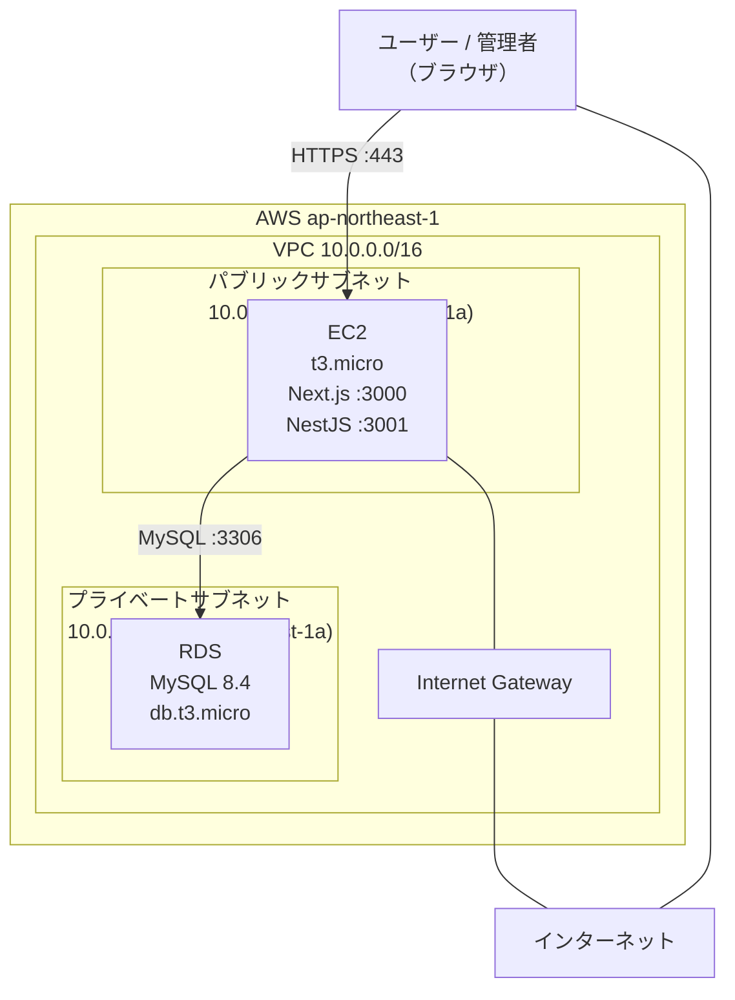

# インフラ設計書

## 概要

- **クラウド**: AWS（東京リージョン: `ap-northeast-1`）
- **IaC**: Terraform
- **構成方針**: 学習用の最小構成（ロードバランサー・Auto Scaling なし）

---

## AWS 構成図



---

## ネットワーク設計

### VPC

| 項目 | 値 |
| --- | --- |
| CIDR | `10.0.0.0/16` |
| リージョン | `ap-northeast-1`（東京） |

### サブネット

| 名前 | CIDR | AZ | 用途 |
| --- | --- | --- | --- |
| パブリックサブネット | `10.0.1.0/24` | `ap-northeast-1a` | EC2（インターネット接続あり） |
| プライベートサブネット | `10.0.2.0/24` | `ap-northeast-1a` | RDS（インターネット接続なし） |

### セキュリティグループ

#### EC2 用（`sg-app`）

| 方向 | プロトコル | ポート | 送信元 | 用途 |
| --- | --- | --- | --- | --- |
| インバウンド | TCP | 443 | `0.0.0.0/0` | HTTPS（フロントエンド・API） |
| インバウンド | TCP | 22 | 作業端末の IP | SSH（デプロイ・メンテナンス） |
| アウトバウンド | 全て | 全て | `0.0.0.0/0` | 外部通信全般 |

#### RDS 用（`sg-db`）

| 方向 | プロトコル | ポート | 送信元 | 用途 |
| --- | --- | --- | --- | --- |
| インバウンド | TCP | 3306 | `sg-app` | EC2 からの MySQL 接続のみ許可 |
| アウトバウンド | 全て | 全て | `0.0.0.0/0` | — |

---

## EC2

| 項目 | 値 |
| --- | --- |
| インスタンスタイプ | `t3.micro` |
| AMI | Amazon Linux 2023 |
| ストレージ | 20 GB（gp3） |
| 配置 | パブリックサブネット |
| Elastic IP | なし（学習用途のため動的 public IP を使用） |

**動作するプロセス**

| プロセス | ポート | 備考 |
| --- | --- | --- |
| Next.js | 3000 | フロントエンド |
| NestJS | 3001 | バックエンド API |
| Nginx | 80 / 443 | リバースプロキシ・HTTPS 終端 |

**Nginx ルーティング**

| パス | 転送先 |
| --- | --- |
| `/api/*` | `http://localhost:3001` |
| それ以外 | `http://localhost:3000` |

---

## RDS

| 項目 | 値 |
| --- | --- |
| エンジン | MySQL 8.4 |
| インスタンスクラス | `db.t3.micro` |
| ストレージ | 20 GB（gp2） |
| マルチ AZ | なし（学習用途のため） |
| 自動バックアップ | 有効（保持期間: 7 日） |
| 配置 | プライベートサブネット |
| パブリックアクセス | 無効 |

---

## Terraform 構成

### ディレクトリ構成

```
terraform/
├── main.tf          # プロバイダー設定・バックエンド設定
├── variables.tf     # 変数定義
├── outputs.tf       # 出力値（EC2 IP・RDS エンドポイント）
├── vpc.tf           # VPC・サブネット・Internet Gateway・ルートテーブル
├── security_groups.tf  # セキュリティグループ
├── ec2.tf           # EC2 インスタンス・Elastic IP・キーペア
├── rds.tf           # RDS インスタンス・サブネットグループ
└── terraform.tfvars # 変数の実際の値（Git 管理外）
```

> `terraform.tfvars` には DB パスワード・SSH キーパスなどの機密情報が含まれるため `.gitignore` に追加すること。

### 主要リソース

| ファイル | Terraform リソース |
| --- | --- |
| `vpc.tf` | `aws_vpc`, `aws_subnet`, `aws_internet_gateway`, `aws_route_table` |
| `security_groups.tf` | `aws_security_group`（app / db） |
| `ec2.tf` | `aws_instance`, `aws_eip`, `aws_key_pair` |
| `rds.tf` | `aws_db_instance`, `aws_db_subnet_group` |

### Terraform 操作手順

```bash
# 初期化
terraform init

# 変更内容の確認
terraform plan

# 適用
terraform apply

# 削除（学習終了時）
terraform destroy
```

---

## デプロイフロー

```
1. ローカルでコードを変更・コミット・PR → main マージ

2. EC2 に SSH 接続
   ssh -i <key.pem> ec2-user@<Elastic IP>

3. リポジトリを更新
   git pull origin main

4. バックエンドをビルド・再起動
   cd backend
   npm install
   npm run build
   pm2 restart nestjs

5. フロントエンドをビルド・再起動
   cd frontend
   npm install
   npm run build
   pm2 restart nextjs
```

> プロセス管理には **PM2** を使用し、EC2 再起動後も自動起動されるよう設定する（`pm2 startup`）。

---

## 環境変数

アプリケーションの動作に必要な環境変数は EC2 上の `.env` ファイルで管理する。

| 変数名 | 設定箇所 | 内容 |
| --- | --- | --- |
| `DATABASE_HOST` | バックエンド | RDS エンドポイント |
| `DATABASE_PORT` | バックエンド | `3306` |
| `DATABASE_NAME` | バックエンド | DB 名 |
| `DATABASE_USER` | バックエンド | DB ユーザー名 |
| `DATABASE_PASSWORD` | バックエンド | DB パスワード |
| `JWT_SECRET` | バックエンド | JWT 署名シークレット（32 文字以上のランダム文字列） |
| `NEXT_PUBLIC_API_URL` | フロントエンド | バックエンド API の URL |

> `.env` ファイルは Git にコミットしない（`.gitignore` に追加済み）。

---

## スコープ外

学習用途のため以下は対象外とする。

- ロードバランサー（ALB）
- Auto Scaling
- CloudFront / S3 による静的配信
- CI/CD パイプライン（GitHub Actions 等）
- WAF・Shield
- 監視・アラート（CloudWatch）
