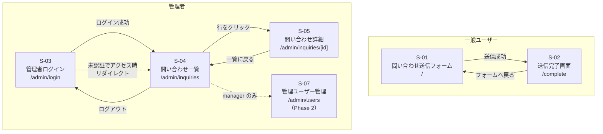

# 画面設計書

## 概要

本書は問い合わせ管理アプリの画面設計を定義する。

- **MVP（フェーズ 1）**: S-01〜S-05 を実装対象とする
- **Phase 2**: S-06〜S-07 は本書では概要のみ記載し、別途詳細化する

### ロール別アクセス可能画面

| ロール | アクセス可能な画面 |
| --- | --- |
| 一般ユーザー（認証不要） | S-01, S-02 |
| 管理者スタッフ | S-03, S-04, S-05, S-06 |
| マネージャー | 全画面（S-07 含む） |

---

## 画面一覧

| 画面 ID | 画面名 | URL | 認証 | フェーズ |
| --- | --- | --- | --- | --- |
| S-01 | 問い合わせ送信フォーム | `/` | 不要 | MVP |
| S-02 | 送信完了画面 | `/complete` | 不要 | MVP |
| S-03 | 管理者ログイン | `/admin/login` | 不要 | MVP |
| S-04 | 問い合わせ一覧 | `/admin/inquiries` | 必要 | MVP |
| S-05 | 問い合わせ詳細 | `/admin/inquiries/[id]` | 必要 | MVP |
| S-06 | 内部コメント（S-05 内セクション） | — | 必要 | Phase 2 |
| S-07 | 管理ユーザー管理 | `/admin/users` | 必要（manager） | Phase 2 |

---

## 画面遷移図



---

## 各画面の詳細仕様

---

### S-01 問い合わせ送信フォーム

| 項目 | 内容 |
| --- | --- |
| 画面 ID | S-01 |
| URL | `/` |
| 認証 | 不要 |
| 対応機能要件 | F-01 |

#### ワイヤーフレーム

```
┌────────────────────────────────────────────┐
│         お問い合わせ                          │
├────────────────────────────────────────────┤
│                                            │
│  お名前 *                                   │
│  ┌──────────────────────────────────────┐  │
│  │                                      │  │
│  └──────────────────────────────────────┘  │
│                                            │
│  メールアドレス *                             │
│  ┌──────────────────────────────────────┐  │
│  │                                      │  │
│  └──────────────────────────────────────┘  │
│                                            │
│  件名 *                                    │
│  ┌──────────────────────────────────────┐  │
│  │                                      │  │
│  └──────────────────────────────────────┘  │
│                                            │
│  お問い合わせ内容 *                           │
│  ┌──────────────────────────────────────┐  │
│  │                                      │  │
│  │                                      │  │
│  │                                      │  │
│  └──────────────────────────────────────┘  │
│                                            │
│              [  送信する  ]                  │
│                                            │
└────────────────────────────────────────────┘
```

#### 表示要素

| 要素 | 種別 | 必須 | 備考 |
| --- | --- | --- | --- |
| お名前 | テキスト入力 | ○ | |
| メールアドレス | メール入力 | ○ | |
| 件名 | テキスト入力 | ○ | |
| お問い合わせ内容 | テキストエリア | ○ | |
| 送信するボタン | ボタン | — | |
| honeypot フィールド | 非表示入力 | — | スパム対策。非表示で name="website" |

#### 操作・インタラクション

| 操作 | 動作 |
| --- | --- |
| 送信するボタンをクリック | バリデーション実行 → 成功時 API 送信 → S-02 へリダイレクト |
| 送信中 | ボタンを無効化してローディング表示 |
| honeypot フィールドに値あり | クライアント側でフォーム送信をブロック |

#### バリデーション

| フィールド | ルール |
| --- | --- |
| お名前 | 必須、1〜255 文字、前後空白をトリム |
| メールアドレス | 必須、RFC 5322 準拠、255 文字以内 |
| 件名 | 必須、1〜100 文字、前後空白をトリム |
| お問い合わせ内容 | 必須、1〜2000 文字、前後空白をトリム |

#### エラー表示

| ケース | 表示箇所 | メッセージ例 |
| --- | --- | --- |
| 必須フィールド未入力 | フィールド直下 | 「お名前を入力してください」 |
| メール形式不正 | フィールド直下 | 「正しいメールアドレスを入力してください」 |
| 最大文字数超過 | フィールド直下 | 「100 文字以内で入力してください」 |
| サーバーエラー（5xx） | フォーム上部 | 「送信に失敗しました。時間をおいて再度お試しください」 |
| レート制限（429） | フォーム上部 | 「送信回数の制限に達しました。しばらくお待ちください」 |

#### API 連携

| メソッド | エンドポイント |
| --- | --- |
| POST | `/api/inquiries` |

---

### S-02 送信完了画面

| 項目 | 内容 |
| --- | --- |
| 画面 ID | S-02 |
| URL | `/complete` |
| 認証 | 不要 |
| 対応機能要件 | F-02 |

#### ワイヤーフレーム

```
┌────────────────────────────────────────────┐
│         お問い合わせ                          │
├────────────────────────────────────────────┤
│                                            │
│         ✓ 送信が完了しました                  │
│                                            │
│   お問い合わせを受け付けました。               │
│   内容を確認のうえ、担当者よりご連絡いたします。 │
│                                            │
│   受付番号: 42                              │
│                                            │
│         [ 新しいお問い合わせを送る ]            │
│                                            │
└────────────────────────────────────────────┘
```

#### 表示要素

| 要素 | 備考 |
| --- | --- |
| 完了メッセージ | 固定テキスト |
| 受付番号 | inquiry.id を表示（MVP 仕様） |
| フォームへ戻るリンク | S-01 へ遷移 |

#### 操作・インタラクション

| 操作 | 動作 |
| --- | --- |
| フォームへ戻るリンクをクリック | S-01 へ遷移 |
| URL を直接入力してアクセス | 受付番号なしで完了メッセージのみ表示（受付番号行を非表示） |

---

### S-03 管理者ログイン

| 項目 | 内容 |
| --- | --- |
| 画面 ID | S-03 |
| URL | `/admin/login` |
| 認証 | 不要（認証済みの場合 S-04 へリダイレクト） |
| 対応機能要件 | F-03 |

#### ワイヤーフレーム

```
┌────────────────────────────────────────────┐
│                                            │
│           管理者ログイン                     │
│                                            │
│  メールアドレス                              │
│  ┌──────────────────────────────────────┐  │
│  │                                      │  │
│  └──────────────────────────────────────┘  │
│                                            │
│  パスワード                                 │
│  ┌──────────────────────────────────────┐  │
│  │ ••••••••                             │  │
│  └──────────────────────────────────────┘  │
│                                            │
│  ┌──────────────────────────────────────┐  │
│  │           ログイン                    │  │
│  └──────────────────────────────────────┘  │
│                                            │
└────────────────────────────────────────────┘
```

#### 表示要素

| 要素 | 種別 | 必須 | 備考 |
| --- | --- | --- | --- |
| メールアドレス | メール入力 | ○ | |
| パスワード | パスワード入力 | ○ | マスク表示 |
| ログインボタン | ボタン | — | |

#### 操作・インタラクション

| 操作 | 動作 |
| --- | --- |
| ログインボタンをクリック | バリデーション → API 呼び出し → 成功時 S-04 へリダイレクト |
| 認証済みでアクセス | S-04 へリダイレクト |

#### バリデーション

| フィールド | ルール |
| --- | --- |
| メールアドレス | 必須、メール形式 |
| パスワード | 必須 |

#### エラー表示

| ケース | 表示箇所 | メッセージ |
| --- | --- | --- |
| 認証失敗 | フォーム上部 | 「メールアドレスまたはパスワードが正しくありません」（ユーザー存在の有無を明示しない） |
| 必須未入力 | フィールド直下 | 「入力してください」 |

#### API 連携

| メソッド | エンドポイント |
| --- | --- |
| POST | `/api/auth/login` |

---

### S-04 問い合わせ一覧

| 項目 | 内容 |
| --- | --- |
| 画面 ID | S-04 |
| URL | `/admin/inquiries` |
| 認証 | 必要（未認証時 S-03 へリダイレクト） |
| 対応機能要件 | F-04, F-06 |

#### ワイヤーフレーム

```
┌────────────────────────────────────────────────────────────────┐
│  問い合わせ管理システム          未対応: 5 件    [ログアウト]      │
├────────────────────────────────────────────────────────────────┤
│                                                                │
│  フィルター: [全て ▼]   ソート: [受信日時（新しい順） ▼]          │
│                                                                │
│ ┌──────┬────────────┬──────────┬──────────────┬────────┬────┐ │
│ │受付番号│ 受信日時   │ 氏名     │ 件名         │ステータス│経過│ │
│ ├──────┼────────────┼──────────┼──────────────┼────────┼────┤ │
│ │ 001  │ 2026-04-29 │ 山田 太郎 │ 製品について… │🔴 未対応│ 3日│ │  ← 強調
│ │ 002  │ 2026-04-28 │ 佐藤 花子 │ 返金につい… │🟡 対応中│ 4日│ │
│ │ 003  │ 2026-04-27 │ 鈴木 一郎 │ ログインが… │🟢 完了  │ 5日│ │
│ └──────┴────────────┴──────────┴──────────────┴────────┴────┘ │
│                                                                │
│                    ← 1  2  3 →                                │
│                                                                │
└────────────────────────────────────────────────────────────────┘
```

#### 表示要素

| 要素 | 備考 |
| --- | --- |
| 未対応件数バッジ | status = open の件数をヘッダーに表示 |
| ステータスフィルター | 全て / 未対応（open）/ 対応中（in_progress）/ 完了（closed） |
| ソートドロップダウン | 受信日時（新しい順）/ 受信日時（古い順）/ 経過日数（長い順） |
| テーブル（受付番号） | inquiry.id |
| テーブル（受信日時） | YYYY-MM-DD HH:mm 形式 |
| テーブル（氏名） | |
| テーブル（件名） | 長い場合は末尾を省略（…） |
| テーブル（ステータス） | アイコン + ラベル（下表参照） |
| テーブル（経過日数） | 受信から現在までの日数 |
| 行の強調表示 | status = open かつ 3 日超過の行を背景色で強調 |
| ページネーション | 20 件/ページ固定、ページ番号を URL クエリ `?page=N` で保持 |
| ログアウトボタン | クリックでセッション破棄 → S-03 へリダイレクト |

##### ステータス表示

| status 値 | アイコン | ラベル |
| --- | --- | --- |
| open | 🔴 | 未対応 |
| in_progress | 🟡 | 対応中 |
| closed | 🟢 | 完了 |

#### 操作・インタラクション

| 操作 | 動作 |
| --- | --- |
| テーブル行をクリック | S-05（問い合わせ詳細）へ遷移 |
| フィルター変更 | 1 ページ目にリセットしてリスト再取得 |
| ソート変更 | 1 ページ目にリセットしてリスト再取得 |
| ページネーションをクリック | 指定ページを URL クエリに反映してリスト再取得 |
| ログアウトボタンをクリック | ログアウト API 呼び出し → S-03 へリダイレクト |

#### API 連携

| メソッド | エンドポイント | パラメータ |
| --- | --- | --- |
| GET | `/api/inquiries` | `status`, `sort`, `page` |
| POST | `/api/auth/logout` | — |

---

### S-05 問い合わせ詳細

| 項目 | 内容 |
| --- | --- |
| 画面 ID | S-05 |
| URL | `/admin/inquiries/[id]` |
| 認証 | 必要（未認証時 S-03 へリダイレクト） |
| 対応機能要件 | F-05 |

#### ワイヤーフレーム

```
┌────────────────────────────────────────────────────────────────┐
│  問い合わせ管理システム          未対応: 5 件    [ログアウト]      │
├────────────────────────────────────────────────────────────────┤
│                                                                │
│  ← 一覧に戻る                                                  │
│                                                                │
│  ┌──────────────────────────────────────────────────────────┐  │
│  │  受付番号: 001                       経過日数: 3 日       │  │
│  │  受信日時: 2026-04-29 10:00                               │  │
│  ├──────────────────────────────────────────────────────────┤  │
│  │  氏名:         山田 太郎                                  │  │
│  │  メール:       yamada@example.com                         │  │
│  │  件名:         製品について問い合わせです                    │  │
│  ├──────────────────────────────────────────────────────────┤  │
│  │  お問い合わせ内容                                          │  │
│  │                                                          │  │
│  │  製品 A の価格について教えてください。                       │  │
│  │                                                          │  │
│  ├──────────────────────────────────────────────────────────┤  │
│  │  ステータス                                               │  │
│  │  [🔴 未対応 ▼]                  [保存する]               │  │
│  └──────────────────────────────────────────────────────────┘  │
│                                                                │
└────────────────────────────────────────────────────────────────┘
```

#### 表示要素

| 要素 | 備考 |
| --- | --- |
| 受付番号 | inquiry.id |
| 経過日数 | 受信から現在までの日数 |
| 受信日時 | YYYY-MM-DD HH:mm 形式 |
| 氏名 | |
| メールアドレス | |
| 件名 | |
| お問い合わせ内容 | 改行を保持して表示 |
| ステータスドロップダウン | open / in_progress / closed から選択 |
| 保存するボタン | ステータス変更を保存 |
| 一覧に戻るリンク | S-04 へ遷移 |

#### 操作・インタラクション

| 操作 | 動作 |
| --- | --- |
| ステータスドロップダウンを変更 | 保存するボタンが有効になる |
| 保存するボタンをクリック | ステータス更新 API 呼び出し → 成功時インライン表示更新 |
| 一覧に戻るリンクをクリック | S-04 へ遷移（フィルター・ページ状態を保持） |
| 存在しない ID でアクセス | 404 画面を表示 |

#### エラー表示

| ケース | 表示箇所 | メッセージ |
| --- | --- | --- |
| ステータス保存失敗 | 保存ボタン周辺 | 「更新に失敗しました。再度お試しください」 |
| 404 | 画面全体 | 「お探しの問い合わせが見つかりませんでした」 |

#### API 連携

| メソッド | エンドポイント |
| --- | --- |
| GET | `/api/inquiries/:id` |
| PATCH | `/api/inquiries/:id/status` |

---

## Phase 2 画面（概要のみ）

以下の画面は Phase 2 の実装対象。詳細仕様は Phase 2 開始時に別途定義する。

### S-06 内部コメント

S-05（問い合わせ詳細）の下部に追加されるセクション。

- 投稿済みコメント一覧（投稿者名・日時・本文）
- コメント投稿フォーム（テキストエリア + 投稿ボタン）
- 対応機能要件: F-07

### S-07 管理ユーザー管理

URL: `/admin/users`（manager ロールのみアクセス可能）

- 管理ユーザーの一覧表示（メール・ロール・作成日）
- ユーザー招待
- ロール変更
- 対応機能要件: F-11
